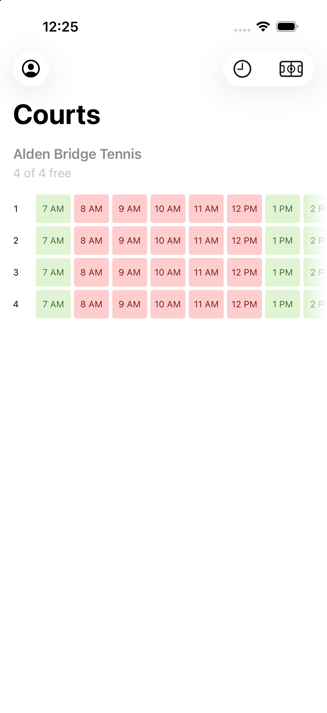
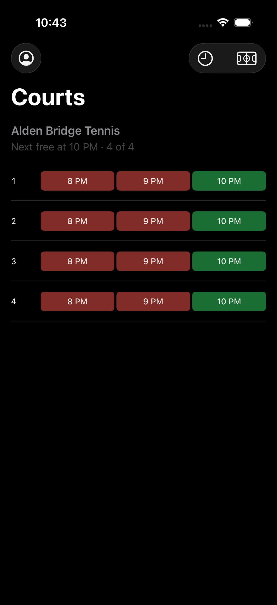

# Court Watch

An iOS app that answers one question: **which tennis courts are free right now?**

The Woodlands Township publishes court availability through ActiveCommunities.
Finding an open court means signing into a website, picking a facility, reading a
grid, and going back for the next one. This app collapses that into opening it
and looking.

| Light | Dark |
|---|---|
|  |  |

Left: the whole day at three of the facilities you follow. Right: the same
screen at 8 PM, when only three hours are left and everything nearby is booked
until ten.

## What it does

- **One glance, no tapping.** Every court at every facility you follow, with its
  whole remaining day, on one screen. Nothing to drill into.
- **Your places, by name.** Pick *Shadowbend*, not *Shadowbend Tennis 3*. All five
  of its courts come with it. 27 facilities, 80 courts.
- **Only what's still to come.** Hours that have ended are hidden — but a slot
  lives until its hour *ends*, so at 2:15 the 2 PM row is still there.
- **A start time when you want one.** Ask for 9 AM and you get 9 AM, even at nine
  in the evening. Asking is an instruction, not a preference.
- **No sign-in required.** Availability is identical whether you sign in or not,
  so the account screen is entirely optional.

## Requirements

- iOS 26.0 or later, iPhone or iPad
- Xcode 26, Swift 6

## Running it

```bash
./Scripts/build.sh      # build for the simulator
./Scripts/test.sh       # 473 tests, iPhone and iPad
```

Neither needs an Apple Developer account: a simulator build is unsigned, so a
fresh clone builds and tests with no setup at all.

To run it on a physical iPhone, sign it with your own team:

```bash
cp Config/Local.xcconfig.example Config/Local.xcconfig
# then put your ten-character team id in it
```

That file is gitignored. It exists so that signing never touches a tracked
file — Xcode writes `DEVELOPMENT_TEAM` into the project the moment you build
to a device, and a team id committed by one person is of no use to anyone
else and has to be removed before they can build at all.

The scripts set `DEVELOPER_DIR` themselves and resolve a simulator by UDID rather
than by name — several simulators share the name *iPhone 17 Pro*, and picking by
name silently targets an arbitrary one.

### The other scripts

| Script | Purpose |
|---|---|
| `test-24h.sh` | Runs the suite on a simulator forced into 24-hour time |
| `check-time-discipline.sh` | Fails if date formatting escapes `CourtTime.swift` |
| `test-live.sh` | One opt-in call to the real endpoint, checking its shape |
| `capture-screenshots.sh` | Regenerates `docs/screenshots/` |

## How it's put together

```
CourtWatch/
├── API/          CSRF handshake, availability client, sign-in, error taxonomy
├── Models/       wire decoding and the domain types it produces
├── Features/
│   ├── Availability/   the grid, its layout tiers, the start-time filter
│   ├── Favorites/      choosing and persisting facilities
│   └── Account/        optional sign-in
└── Support/      time, search, credential storage, failure simulation
```

`ContentView` owns the only network call. Everything below it takes what it needs
as a parameter, which keeps those screens previewable and keeps a client out of
the view layer.

## Things worth knowing about the upstream API

It is undocumented and unversioned, and it is unusual in three ways that shaped
the code:

**Errors hide inside a `200`.** Every response is HTTP 200; success lives in
`headers.response_code`. Retry logic keyed on status codes would never fire.

**Sign-in reports failure as success.** A rejected password returns
`response_code: "0000"` — *Successful* — with the real answer in
`body.result.success`. The app reads the inner value and then independently
confirms the session before believing it.

**`end_time` is exclusive.** Asking for 12:00–22:00 returns 12:00 through 21:00.
The app once shortened the day by an hour on every filtered refresh because of
it; it now holds the whole day and filters locally.

Availability itself needs no account: a CSRF handshake plus `customer_id: 0`
returns all 80 courts. A matched-pair comparison found **0 of 80 courts differing
across 1,280 slots** between a signed-in capture and an anonymous one.

## Correctness

473 tests, and a few conventions that exist because the failures they prevent are
silent rather than loud:

- **All date handling lives in one file.** `check-time-discipline.sh` fails the
  build if a formatter is built anywhere else — an unpinned formatter prints
  24-hour times on a device set that way, and can shift a parsed year by
  centuries under a non-Gregorian calendar.
- **The 24-hour suite carries a negative control.** It asserts the simulator
  genuinely rendered `14:00`, so a run that silently failed to apply the setting
  reports that its premise broke rather than passing vacuously.
- **Tests are hermetic.** The suite uses mock transports; the one live check is
  behind `COURTWATCH_LIVE=1`.
- **A malformed court degrades alone.** One unreadable entry used to throw away
  all 80. Slots are positionally parallel to the published hours, so a bad entry
  becomes a placeholder rather than a deletion — dropping it would shift every
  later hour an hour earlier and advertise a court as free when it isn't.

## Accessibility

- 12-hour times regardless of the device's 24-hour setting
- With *Differentiate Without Color*, fills give way to solid, outlined and
  hatched treatments plus symbols
- VoiceOver announces each cell as court, time and availability
- Dynamic Type through the accessibility sizes; at the largest, the grid becomes
  a readable list

## Not in scope

Booking a court, days other than today, notifications, and non-tennis facilities.
The website already books; this app answers whether it's worth opening.

## Licence

MIT — see [LICENSE](LICENSE).

## Note

Unofficial, personal, and not affiliated with The Woodlands Township or
ActiveCommunities. It reads the same public availability a browser does, only
when you ask it to.
