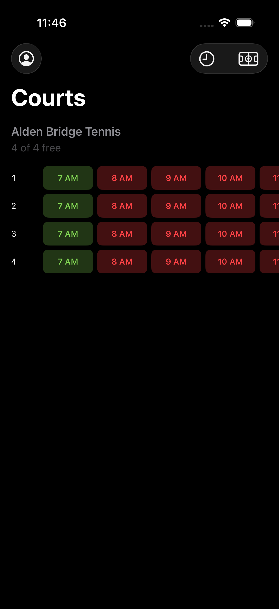
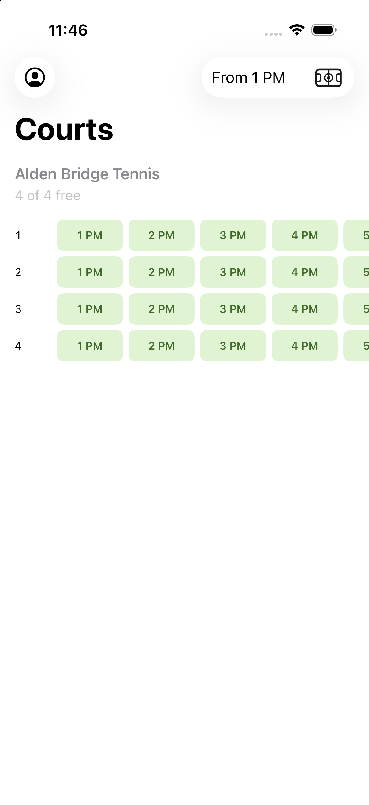
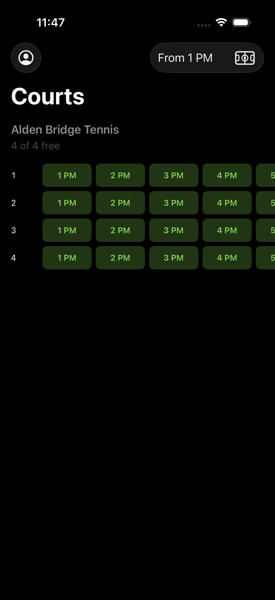
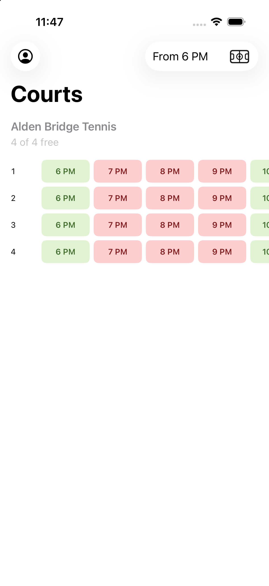
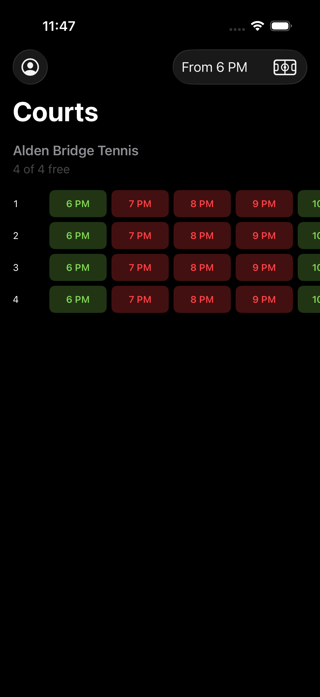
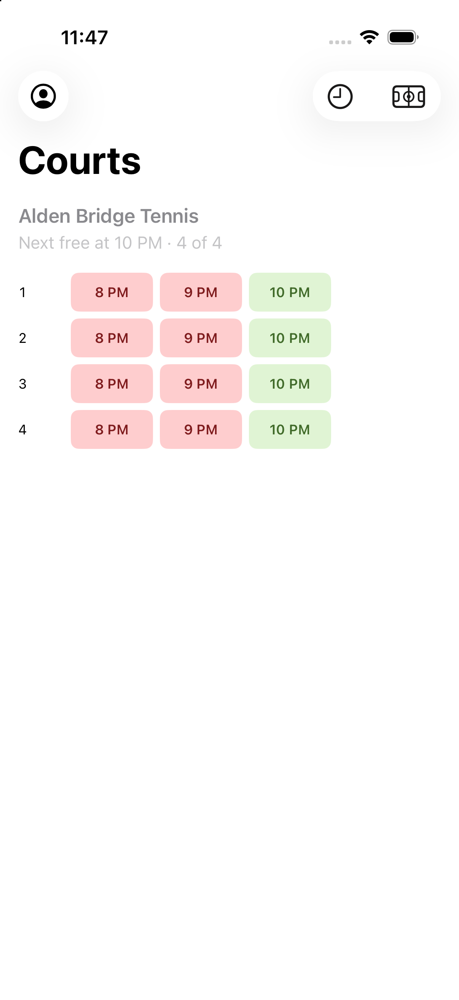
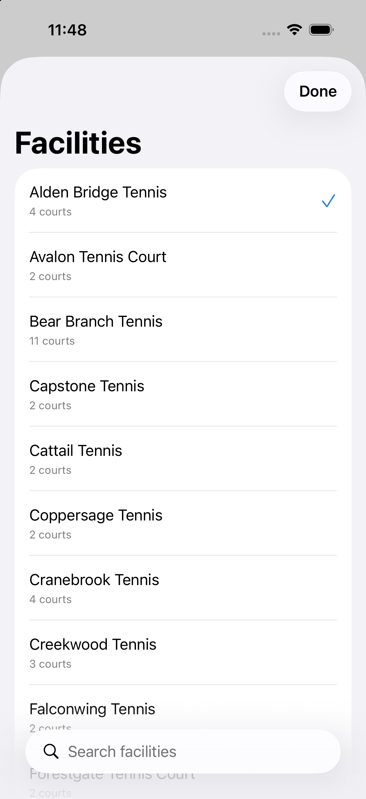
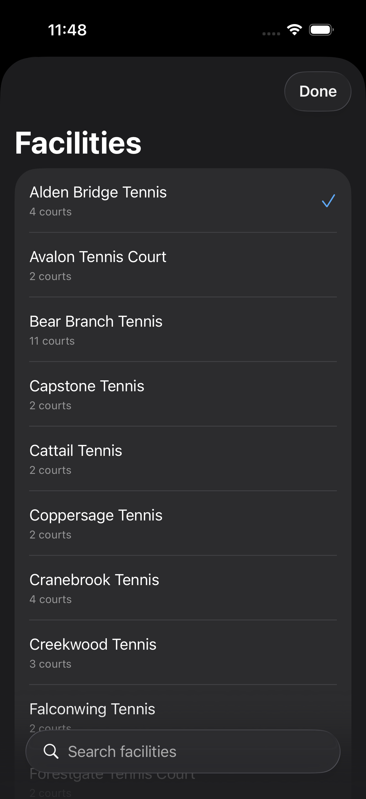

# Court Watch — Screens

Tennis court availability for The Woodlands Township, on iOS 26.

Every shot is from the real app against the live availability endpoint, captured
on an iPhone 17 Pro simulator. Reproduce them with:

```bash
./Scripts/capture-screenshots.sh
```

The clock is pinned per shot so the whole day is visible — the app normally hides
hours that have already ended, which would make most of these two cells wide.

---

## The day, unfiltered

Every court at your chosen facilities, with the day running left to right. Each
court's hours scroll horizontally, and every court at a place scrolls together,
so 9 AM stays under 9 AM down the whole facility. The court numbers are pinned
outside the scroll, so a row never loses its identity as you swipe.

The header answers the question before you read a single cell — and now that the
day no longer fits on one screen, it is the only thing that does so without a
gesture: **2 of 5 free** when the place is open at the hour you are looking at,
and **Next free at 10 PM · 2 of 5** when it is not. The time is named only when
it differs from the leading column, so the line can never be mistaken for a
filter that was ignored.

Green is open, red is taken, and every block writes its own hour inside itself.
There is no hour ruler above the rows any more: a ruler could only label every
few columns, which left two cells in three to be counted across.

| Light | Dark |
|---|---|
|  |  |

---

## Filtered from 1 PM

Choosing an hour narrows the day. The active filter is named in the toolbar
control that sets it, so a quiet-looking afternoon can never be mistaken for a
fully booked one.

Picking an hour is treated as an instruction rather than a preference: it reaches
back past the current time if you ask it to, and the app never claims the day is
over while a filter is set.

| Light | Dark |
|---|---|
|  |  |

---

## Filtered from 6 PM

Fewer hours left in the day means the whole row fits on screen with nothing to
swipe. Same data, same rules, same cell size — only the number of them changed.

| Light | Dark |
|---|---|
|  |  |

---

## Late in the day

Unfiltered at 8:15 PM. Only the hours still to come are shown, and a slot lives
until its hour *ends* — at 8:15 the 8 PM row is still there, because a court free
until 9 is still worth walking to.

| Light | Dark |
|---|---|
|  |  |

---

## Choosing facilities

Twenty-seven facilities, eighty courts. You pick **places**, not court numbers —
choosing Shadowbend shows all five of its courts.

Search folds apostrophes on both sides, so `Harper's` typed on the software
keyboard finds `Harper's Landing Tennis Court` even though iOS inserts a curly
apostrophe and the data holds a straight one.

| Light | Dark |
|---|---|
|  |  |

---

## Notes on the design

**Colour is the primary channel, but never the only one.** With iOS's
*Differentiate Without Color* enabled, the fills give way to solid, outlined and
hatched treatments plus symbols — three different amounts of ink, which survive
greyscale and every form of colour blindness.

**Times are always 12-hour**, even on a device set to 24-hour time, and always in
US Central regardless of where the phone is. Minutes are dropped from the hourly
slots (`10 PM`) but kept on timestamps (`Updated 10:17 PM`), where they carry
information.

**Nothing here requires signing in.** Availability was measured to be identical
signed in and out — 0 of 80 courts differed across 1,280 slots — so the account
screen is entirely optional.
